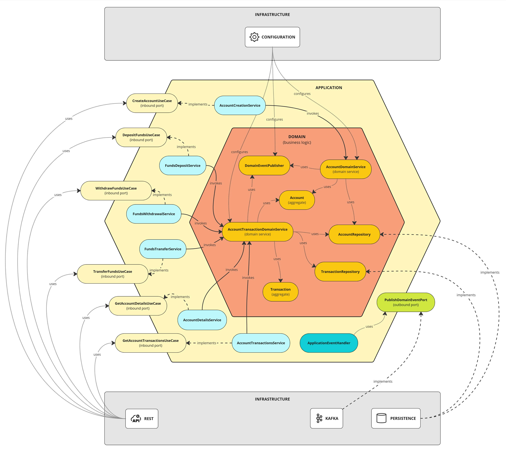

# Microservice hexagonal architecture reference
This is my interpretation of a microservice hexagonal (ports and adapters) architecture in combination with DDD as a reference to use in other projects.

